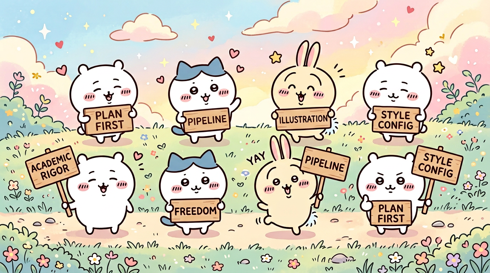
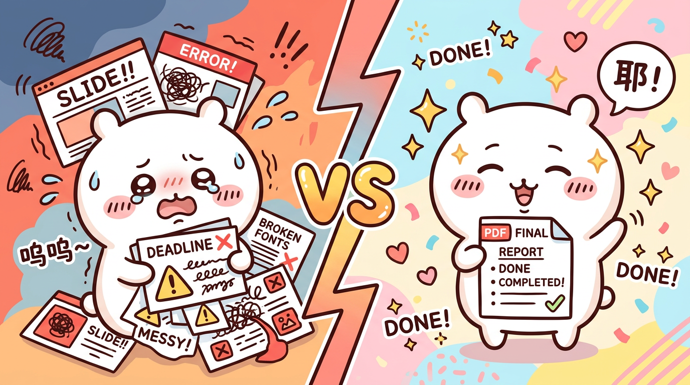
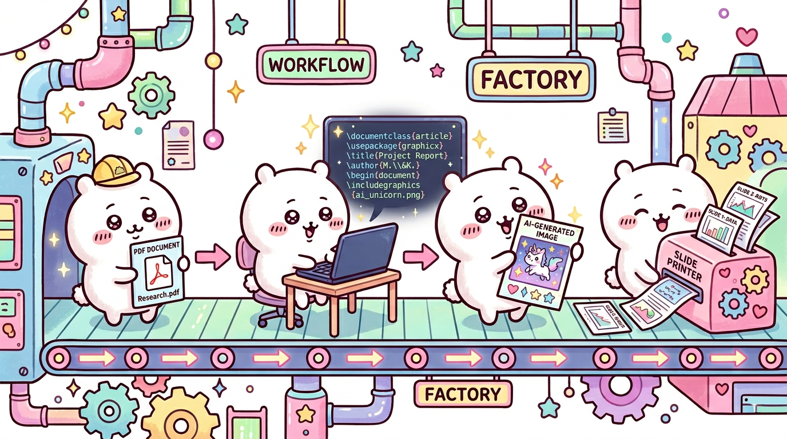

<div align="center">


# A Click is All You Need
### 研究生PPT汇报解救器

**One sentence to Cursor AI — get a professional bilingual academic presentation.**

[](https://www.tug.org/xelatex/)
[](https://ctan.org/pkg/ctex)
[](https://ctan.org/pkg/beamer)
[](https://cursor.sh)
[](LICENSE)

> *For every grad student who has ever stared at a blank PowerPoint at 11pm.*

</div>

---

## What is this?

**A Click is All You Need** is a Cursor-native workflow that turns raw academic materials — a PDF chapter, a DOCX outline, or just an idea — into a polished, bilingual (Chinese + English) Beamer presentation, complete with a speaker script, in one conversation with an AI agent.

No templates to drag-and-drop. No fonts flying around between Windows and Mac. No last-minute "the slides look different on the projector" panic. Just type what you want, confirm a plan, and let the pipeline run.

The workflow lives entirely inside your Cursor IDE: skills, agents, rules, and quality reviewers are all pre-wired. You only touch one configuration file (`config.tex`) to set your fonts and colors.

---

## 为什么做这个？ / Why build this?

每次学术汇报，研究生面对的不只是内容——还有：

- 在 PowerPoint 里逐帧调字号，跨系统乱版
- 找了半天图，分辨率还不够
- 做完 PPT 才发现还要另写讲稿
- 改了一个公式，整个排版垮了

**A Click is All You Need** 把这些全部自动化。你负责思考，AI 负责排版。

---

## ✨ Features / 核心功能

<div align="center">

</div>

### A · Academic Rigor / 学术严谨性

XeLaTeX + Beamer produces publication-quality PDFs with pt-level precision — no pixel-pushing, no font substitution across platforms. Say goodbye to the "it looked fine on my laptop" problem.

> XeLaTeX + Beamer 输出学术级 PDF，字号 pt 精确，跨平台完全一致。结束"我电脑上没问题"的噩梦。

### B · Presentation Freedom / 汇报自由度

Narrative arc (Hook → Roadmap → Content → Synthesis → Discussion) is baked into the workflow. TikZ diagrams — DAGs, timelines, triangle graphs, flowcharts — are generated in code, not screenshot-pasted.

> 叙事弧内置于流水线，TikZ 图形代码生成，无需截图拼贴，任意扩展。

### C · End-to-End Pipeline / 完整流水线

Eight stages from intake to delivery: **Material Intake → Scaffold → Content Generation → Illustration → Compile → AI Review → Script → Delivery**. No step falls through the cracks; output is reproducible every time.

> 8 阶段从摄入到交付，全程有序，每次运行结果一致，所有 `.tex` 源文件可 git 追踪回滚。

### D · Requirements-First / Plan 模式主动问需求

AI **never guesses**. Before writing a single line of LaTeX, it enters Plan Mode and collects your requirements across five dimensions: content, format, output config, visual style, and narrative preference. Prevents costly rework from misaligned direction.

> AI 不猜需求。先进入 Plan 模式，5 个维度结构化问卷确认，防止方向跑偏后大量返工，节省 50%+ 沟通成本。

### E · Triple AI Review / 三重 AI 质量审查

Three specialized agents run in parallel before delivery:
- **slide-auditor** — checks for text overflow, font size, image references
- **tikz-reviewer** — checks for node collisions, label readability in diagrams
- **pedagogy-reviewer** — checks narrative arc, pacing, terminology consistency

> 三个专责 agent 并行审查：布局溢出、TikZ 碰撞、叙事节奏，串行修复，缺陷率远低于人工单轮检查。

### F · Script Sync / 讲稿同步输出

`slides.pdf` and `script.pdf` are always delivered together. The script uses `\speakbox` (spoken content) and `\notebox` (stage directions) — formatted to read aloud directly, timed to match your slides.

> `slides.pdf` 和 `script.pdf` 同步交付。讲稿按幻灯片逐页对应，直接可朗读，无需另开文档。

### G · Automated Illustration / AI 配图自动化

Image requirements are identified at intake stage. The pipeline generates Chiikawa-style (or custom) illustrations and embeds them at the correct positions automatically. No manual DPI resizing.

> 摄入阶段即规划配图，AI 生成后自动嵌入，无需手动找图处理分辨率。

### H · Style Configurable / 风格可配置

Font, color palette, and footer text live in a single `config.tex` file. Switch from academic deep blue to forest green in 1 line. The intake questionnaire captures your style preferences and writes `config.tex` for you.

> 字体/配色/页脚集中在 `config.tex` 一处。更换主题色只需改 1 行。摄入问卷自动写入。

---

## Why not PowerPoint or Office? / 为什么不用 Office？

<div align="center">

</div>

| Dimension 维度 | A Click is All You Need | PowerPoint / Office |
|---|---|---|
| **Typesetting precision 排版精度** | XeLaTeX pt-level accuracy | Pixel-level manual tweaking |
| **Font consistency 字体一致性** | `config.tex` — one line, global effect | Click per slide, breaks across OS |
| **CJK + Latin mixing 中英混排** | `ctex` handles spacing automatically | Manual font size / spacing adjustments |
| **Cross-platform consistency 跨平台** | PDF is identical everywhere | Win/Mac renders differently |
| **Graphics quality 图形质量** | TikZ vector — lossless at any resolution | Screenshot embeds — blurry on projector |
| **Version control 版本控制** | `git diff` on `.tex` source | Binary `.pptx` — no meaningful diff |
| **Script sync 讲稿同步** | `script.pdf` auto-generated | Write separately in another document |
| **Quality review 审查智能化** | 3 specialized AI agents in parallel | Human single-pass check |

---

## 🚀 Quick Start / 快速上手

### Step 1 — Clone & check environment / 克隆并检测环境

```bash
git clone https://github.com/KyrieWong7/graduate-ppt-rescuer.git
cd graduate-ppt-rescuer
bash setup.sh
```

`setup.sh` auto-detects XeLaTeX, Kaiti SC font, Python dependencies, and GitHub CLI. It gives platform-specific install instructions for anything missing.

> `setup.sh` 自动检测 XeLaTeX、楷体字体、Python 依赖和 GitHub CLI，缺失时给出对应平台的安装指引。

### Step 2 — Open in Cursor / 在 Cursor 中打开

```bash
cursor .
```

The `.cursor/` directory contains all skills, agents, and rules. **They load automatically** — no manual configuration needed.

> `.cursor/` 目录包含所有 skills、agents 和 rules，Cursor 自动加载，无需手动配置。

### Step 3 — Say one sentence / 说一句话

```
帮我做一个汇报   /   Make me a presentation
```

The AI switches to **Plan Mode**, runs the intake questionnaire (content, format, output, visual style), then presents a full execution plan for your confirmation. After you approve, the 8-stage pipeline runs automatically.

> AI 切换到 Plan 模式，完成需求问卷后展示完整执行计划，确认后 8 阶段流水线全自动运行。

**Output / 输出:**
```
projects/presentations/[your-topic]/
├── slides.pdf    ← presentation slides
└── script.pdf    ← speaker script
```

---

## 🗂️ Workflow Overview / 工作流总览

<div align="center">

</div>

```
📄 Materials (PDF / DOCX / notes)
    ↓  Stage 1  AI intake — extract key concepts, map structure
    ↓  Stage 2  Scaffold — copy template, set config.tex
    ↓  Stage 3  Content generation — bilingual slides, page by page
    ↓  Stage 4  Illustration — AI image generation, embed
    ↓  Stage 5  First compile (XeLaTeX × 2 passes)
    ↓  Stage 6  Triple AI review + fix loop (max 3 rounds)
    ↓  Stage 7  Script generation (script.tex → script.pdf)
    ↓  Stage 8  Delivery verification
📑 slides.pdf  +  📝 script.pdf
```

→ Full documentation: [WORKFLOW.md](WORKFLOW.md)

---

## 📁 Repository Architecture / 仓库结构

```
graduate-ppt-rescuer/
├── README.md                         # This file
├── AGENTS.md                         # Cursor AI behavior spec (auto-loaded)
├── WORKFLOW.md                       # 9-step workflow documentation
├── MEMORY.md                         # Reusable lessons for AI agents
├── setup.sh                          # Environment auto-detection script
│
├── .cursor/
│   ├── rules/
│   │   ├── ppt-intake.mdc            # ★ Triggers Plan Mode + collects requirements
│   │   │                             #   Includes visual style questionnaire
│   │   ├── plan-first-workflow.mdc   # Enforce plan before execution
│   │   ├── orchestrator-protocol.mdc # Review loop protocol
│   │   └── session-logging.mdc       # Session log maintenance
│   │
│   ├── skills/
│   │   ├── ppt-pipeline/             # ★ Main orchestration skill (8 stages)
│   │   ├── workflow-intake/          # Requirements intake helper
│   │   ├── slide-excellence/         # Combined slide review
│   │   ├── visual-audit/             # Layout & overflow audit
│   │   ├── pedagogy-review/          # Narrative & pacing review
│   │   ├── create-presentation/      # Presentation creation helper
│   │   └── compile-latex/            # LaTeX compilation helper
│   │
│   └── agents/
│       ├── slide-auditor.md          # Layout checker agent
│       ├── tikz-reviewer.md          # TikZ diagram checker agent
│       └── pedagogy-reviewer.md      # Teaching quality checker agent
│
├── templates/
│   ├── config.tex                    # ★ User configuration (fonts, colors, footer)
│   │                                 #   Edit this file only — do not touch template
│   ├── slides-template.tex           # Bilingual Beamer template (reads config.tex)
│   └── script-template.tex           # Speaker script template (\speakbox/\notebox)
│
├── demo/
│   ├── slides.tex                    # 18-page demo: "A Click is All You Need"
│   ├── slides.pdf                    # Compiled demo presentation
│   ├── script.tex                    # Demo speaker script
│   ├── script.pdf                    # Compiled demo script
│   ├── images/                       # Demo-specific Chiikawa illustrations
│   └── README.md                     # Demo explanation (bilingual)
│
└── assets/
    ├── chiikawa-banner.png           # Hero banner
    ├── chiikawa-features.png         # 8 features illustration
    ├── chiikawa-vs.png               # A Click vs Office comparison
    ├── chiikawa-workflow.png         # Workflow diagram illustration
    └── chiikawa-ending.png           # Footer celebration
```

---

## ⚙️ Configuration / 配置说明

### config.tex — The only file you need to edit / 唯一需要修改的文件

```latex
%% CJK font / 中文字体
%% macOS: Kaiti SC | Windows: KaiTi | Linux: AR PL UKai CN
\newcommand{\cjkfont}{Kaiti SC}

%% Latin font / 英文字体
\newcommand{\latinfont}{Times New Roman}

%% Primary color presets / 主色系预设
\definecolor{deepblue}{RGB}{0,52,102}   % Academic Blue (default)
%% \definecolor{deepblue}{RGB}{0,80,60}  % Forest Green
%% \definecolor{deepblue}{RGB}{60,20,100} % Academic Purple

%% Footer left text / 页脚文字
\newcommand{\footleft}{Course Name · Topic}
```

### Font alternatives by platform / 各平台字体替换

| Platform 平台 | CJK Font 中文字体 | Latin Font 英文字体 |
|---|---|---|
| macOS | `Kaiti SC` (system default) | `Times New Roman` |
| Windows | `KaiTi` | `Times New Roman` |
| Linux | `AR PL UKai CN` (`sudo apt install fonts-arphic-ukai`) | `TeX Gyre Termes` |

---

## 🎓 Demo Example / 效果示例

<div align="center">

</div>

The `demo/` folder contains an 18-page presentation about this project itself, generated using this exact workflow. It demonstrates every available element:

`demo/` 文件夹包含一套用本工作流生成的 18 页示例 PPT，演示所有可用元素：

| Element 元素 | Slides 出现页 |
|---|---|
| Full-page background + TikZ overlay 全页背景+TikZ装饰 | 1, 18 |
| Two-column layout + image 两栏+配图 | 2, 10 |
| TikZ horizontal flowchart TikZ横向流程图 | 3 |
| block / alertblock / exampleblock | 4, 9, 13 |
| TikZ vertical pipeline TikZ竖向流水线 | 5 |
| booktabs comparison table booktabs对比表 | 6, 15 |
| TikZ 2×2 card grid TikZ卡片网格 | 7, 8 |
| verbatim code block 代码块 | 9, 13 |
| TikZ triangle diagram TikZ三角图 | 11 |
| TikZ color swatches + tabular 配色方块+表格 | 12 |
| multirow table multirow表格 | 15 |
| Gold quote + checklist 金色引言+检查清单 | 16, 18 |
| Citation list 引用列表 | 17 |

→ See [demo/README.md](demo/README.md) for full details.

---

## ⚙️ Environment Requirements / 环境要求

| Dependency 依赖 | Purpose 用途 | Install 安装 |
|---|---|---|
| **Cursor** | AI agent host — required | [cursor.sh](https://cursor.sh) |
| **XeLaTeX** | Compilation engine — required | macOS: `brew install --cask mactex-no-gui` |
| **Kaiti SC** | Chinese typeface | macOS: system default 系统自带 |
| **Python 3** | Material extraction | `brew install python` |
| **python-docx** | DOCX reading | `pip3 install python-docx` |
| **PyMuPDF** | PDF reading | `pip3 install pymupdf` |

Run `bash setup.sh` to check all dependencies automatically.

> 运行 `bash setup.sh` 自动检测所有依赖并给出安装指引。

---

## 🐛 FAQ / 常见问题

**Q: Quotation marks render incorrectly (show as backticks)?**
Use Unicode curly quotes `"` `"` (U+201C / U+201D), not ASCII straight quotes `"`. In CJK environments, straight quotes can cause spacing issues. / 使用 Unicode 弯引号，不要用 ASCII 直引号。

**Q: Content overflows the slide (Overfull vbox)?**
Reduce text first; if unavoidable, use `\begin{frame}[shrink=8]{Title}`. / 优先减少文字，必要时用 `[shrink=8]` 参数。

**Q: Font not found error?**
Run `fc-list | grep -i kai` to see the exact font name on your system, then update `config.tex`. / 运行 `fc-list | grep -i kai` 查看实际字体名后更新 `config.tex`。

**Q: TikZ nodes overlap?**
Use `\linewidth` (not `\textwidth`) for column-constrained nodes. Increase `node distance` or scale down with `[scale=0.85]`. / 列内节点用 `\linewidth`；增大 `node distance` 或整体缩小。

**Q: Can I use this without Chinese text?**
Yes — set `\cjkfont` in `config.tex` to any CJK font (or remove `ctex` and use standard Beamer). The template works as a pure English presentation too. / 完全可以，设置合适字体后即为纯英文汇报模板。

**Q: 在 Windows 上怎么配置字体？**
将 `config.tex` 中的 `\newcommand{\cjkfont}{Kaiti SC}` 改为 `\newcommand{\cjkfont}{KaiTi}`，Windows 系统自带楷体。

---

## 🎨 Design Inspiration / 设计灵感

This workflow's slide aesthetics are inspired by and reference:

本工作流的幻灯片美学参考以下来源：

- **Pedro H.C. Sant'Anna** (Vanderbilt University / Microsoft Research) — Beamer color palette, slide rhythm, and information density conventions that balance academic rigor with visual clarity
- **Isaiah Andrews** (Harvard University) — Content hierarchy and pacing conventions for academic seminar presentations
- **Till Tantau, Joseph Wright, Vedran Miletić** — *Beamer User Guide*, the foundational framework for this template's structure and macro design
- **Susan Athey** (Stanford GSB) — Presentation design principles for economics and management research

> The goal is not decoration for its own sake, but to make every typographic choice serve the argument. Every font size, color, and spacing decision has a reason.

> 目标不是为装饰而装饰，而是让每个排版选择服务于论点。每个字号、颜色、间距的决定都有其理由。

---

## 📄 License / 许可证

MIT License — free to use, modify, and distribute with attribution.

MIT 许可证 — 自由使用、修改、分发，保留署名即可。

---

<div align="center">


**slides.pdf and script.pdf are waiting for you. 🎉**

**slides.pdf 和 script.pdf 都在等你。**

*Created by [KyrieWong7](https://github.com/KyrieWong7) — after being tortured by PowerPoint one too many times.*

</div>
